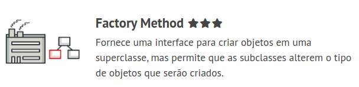
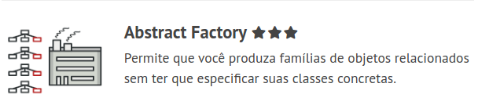
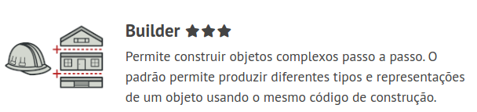
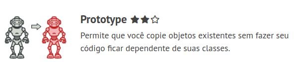
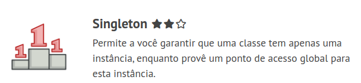
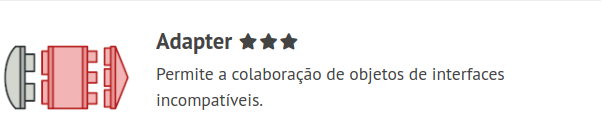
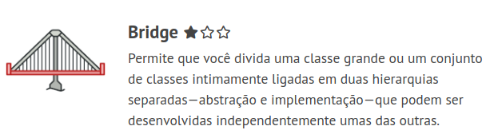
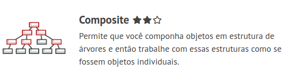
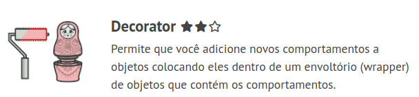
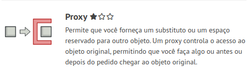

# Design Patterns with typescript

## Extracted from books: 
* Typescript Design Patterns - Vilic Vane
* Mergulho nos padrões de projeto - Alexander Shvets
* Refactoring Guru - refactoring.guru

> 
### Creational Patterns
---

> 
#### Factory Method

> Factory Method is a creational design pattern that provides an interface for creating objects in a superclass, but allows subclasses to alter the type of objects that will be created.

* Use the Factory Method when you don’t know beforehand the exact types and dependencies of the objects your code should work with.
* Use the Factory Method when you want to provide users of your library or framework with a way to extend its internal components.
* Use the Factory Method when you want to save system resources by reusing existing objects instead of rebuilding them each time.

> 

#### Abstract Factory

> Abstract Factory is a creational design pattern that lets you produce families of related objects without specifying their concrete classes.

* Use the Abstract Factory when your code needs to work with various families of related products, but you don’t want it to depend on the concrete classes of those products—they might be unknown beforehand or you simply want to allow for future extensibility.

> 
#### Builder

> Builder is a creational design pattern that lets you construct complex objects step by step. The pattern allows you to produce different types and representations of an object using the same construction code.

* Use the Builder pattern to get rid of a “telescopic constructor”.
* Use the Builder pattern when you want your code to be able to create different representations of some product (for example, stone and wooden houses).
* Use the Builder to construct Composite trees or other complex objects.

> 
#### Prototype

> Prototype is a creational design pattern that lets you copy existing objects without making your code dependent on their classes.

* Use the Prototype pattern when your code shouldn’t depend on the concrete classes of objects that you need to copy.
* Use the pattern when you want to reduce the number of subclasses that only differ in the way they initialize their respective objects. Somebody could have created these subclasses to be able to create objects with a specific configuration.

> 
#### Singleton

> Singleton is a creational design pattern that lets you ensure that a class has only one instance, while providing a global access point to this instance.

* Use the Singleton pattern when a class in your program should have just a single instance available to all clients; for example, a single database object shared by different parts of the program.
* Use the Singleton pattern when you need stricter control over global variables.

> 
### Structural Patterns
---
> 
#### Adapter

> Adapter is a structural design pattern that allows objects with incompatible interfaces to collaborate.

* Use the Adapter class when you want to use some existing class, but its interface isn’t compatible with the rest of your code.
* Use the pattern when you want to reuse several existing subclasses that lack some common functionality that can’t be added to the superclass.

> 
#### Bridge

> Bridge is a structural design pattern that lets you split a large class or a set of closely related classes into two separate hierarchies—abstraction and implementation—which can be developed independently of each other.

* Use the Bridge pattern when you want to divide and organize a monolithic class that has several variants of some functionality (for example, if the class can work with various database servers).
* Use the pattern when you need to extend a class in several orthogonal (independent) dimensions.
* Use the Bridge if you need to be able to switch implementations at runtime.

> 
#### Composite

> Composite is a structural design pattern that lets you compose objects into tree structures and then work with these structures as if they were individual objects.

* Use the Composite pattern when you have to implement a tree-like object structure.
* Use the pattern when you want the client code to treat both simple and complex elements uniformly.

> 
#### Decorator

> Decorator is a structural design pattern that lets you attach new behaviors to objects by placing these objects inside special wrapper objects that contain the behaviors.

* Use the Decorator pattern when you need to be able to assign extra behaviors to objects at runtime without breaking the code that uses these objects.
* Use the pattern when it’s awkward or not possible to extend an object’s behavior using inheritance.

> 
#### Facade

> Facade is a structural design pattern that provides a simplified interface to a library, a framework, or any other complex set of classes.

* Use the Facade pattern when you need to have a limited but straightforward interface to a complex subsystem.
* Use the Facade when you want to structure a subsystem into layers.

> 
#### Proxy

> Proxy is a structural design pattern that lets you provide a substitute or placeholder for another object. A proxy controls access to the original object, allowing you to perform something either before or after the request gets through to the original object.

* Lazy initialization (virtual proxy). This is when you have a heavyweight service object that wastes system resources by being always up, even though you only need it from time to time.
* Access control (protection proxy). This is when you want only specific clients to be able to use the service object; for instance, when your objects are crucial parts of an operating system and clients are various launched applications (including malicious ones).
* Local execution of a remote service (remote proxy). This is when the service object is located on a remote server.
* Local execution of a remote service (remote proxy). This is when the service object is located on a remote server.
* Logging requests (logging proxy). This is when you want to keep a history of requests to the service object.
* Caching request results (caching proxy). This is when you need to cache results of client requests and manage the life cycle of this cache, especially if results are quite large.
* Smart reference. This is when you need to be able to dismiss a heavyweight object once there are no clients that use it.